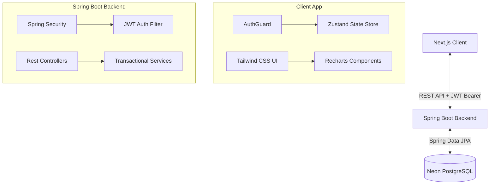

# Supply Chain Management (SCM) System - Detailed Project Profile

This document provides a comprehensive technical overview of the Supply Chain Management (SCM) project. It is structured to serve as an in-depth project walkthrough, technical rationale catalog, and interview preparation guide.

---

## 🚀 Resume Project Profile

### **Supply Chain Management (SCM) System**
*Full-Stack Software Engineer | Java, Spring Boot, React, Next.js, PostgreSQL*

*   **Short Summary**: Built a secure, responsive enterprise-level Supply Chain Management (SCM) system featuring real-time inventory tracking, automated purchase order fulfillment, supplier management, and interactive financial reporting dashboards.
*   **Key Achievements & Metrics (Bullet Points)**:
    *   Designed and implemented a decoupled **Client-Server architecture** using **Spring Boot 3** and **Next.js 16 (React 19)**, ensuring high performance, responsiveness, and clear separation of concerns.
    *   Developed a stateless token-based authentication mechanism using **Spring Security** and **JSON Web Tokens (JWT)** with Role-Based Access Control (**RBAC**) for `ADMIN`, `MANAGER`, and `VIEWER` roles to secure critical API endpoints.
    *   Engineered a transactional inventory automation service using **Spring Data JPA (Hibernate)**; automatically updates product stock quantities upon order completion or cancellation, maintaining strict database consistency.
    *   Integrated a serverless **PostgreSQL (Neon)** database utilizing automated schema migrations, handling complex relational joins for order items, products, and suppliers.
    *   Built an interactive financial analytics dashboard using **Recharts**, delivering real-time visualizations of Cost of Goods Sold (COGS), gross margins, category distributions, and automated low-stock safety alerts.
    *   Managed global frontend state and session persistence using **Zustand**, reducing boilerplate state code and enforcing client-side route protection via a custom `AuthGuard` middleware wrapper.
    *   Configured **Axios** HTTP interceptors on the frontend to inject Bearer tokens into API requests dynamically, resolving security handshakes and managing token expiry states.

---

## 📂 Project Scope & Architecture

The system is designed to streamline **inbound logistics** and **warehouse inventory operations** for medium-scale businesses.



### **Business & System Scope**
1.  **Supplier Management**: A directory of authorized suppliers, complete with contacts and addresses.
2.  **Product & Inventory Ledger**: Complete list of products grouped by categories, tracking stock quantity, cost price, selling price, and a safety margin (**Minimum Stock Level**).
3.  **Automated Order Processing**: Managers can place orders with suppliers. The system automatically updates stock levels when orders transition to `COMPLETED` state.
4.  **Interactive Financial Auditing**: Calculates total inventory valuation, gross profit margin percentages, and product performance trends.
5.  **Role-Based Operations**: 
    *   **ADMIN**: Full control (user management, database adjustments).
    *   **MANAGER**: Inventory updates, supplier additions, order placing/approvals.
    *   **VIEWER**: Read-only access to dashboards, reports, and stock.

---

## 🛠️ Tech Stack & Rationale: Why These Technologies?

Choosing the right tool is a core engineering skill. Below is the rationale for every framework and library used:

### **1. Backend: Spring Boot 3 & Java 17**
*   **Why Java 17?** It is a Long-Term Support (LTS) release, bringing features like Records, enhanced Switch pattern-matching, and virtual threads support, resulting in highly readable and performant code.
*   **Why Spring Boot 3?** 
    *   It is the enterprise standard for building scalable microservices and RESTful APIs.
    *   Offers **Auto-Configuration** (which sets up databases, security, and web engines dynamically, reducing boilerplate configuration code).
    *   Out-of-the-box support for **dependency injection** and **transaction management**.

### **2. Database & ORM: PostgreSQL (Neon) & Hibernate (JPA)**
*   **Why PostgreSQL?** A robust relational database supporting complex transactions (ACID properties), which are absolutely mandatory when dealing with money, order logs, and stock levels.
*   **Why Neon?** Serverless PostgreSQL that scales database compute resources automatically and allows instant database branching for safe development.
*   **Why Hibernate / Spring Data JPA?** Saves time by mapping Java objects directly to database tables (ORM). Provides repositories (`JpaRepository`) which eliminate writing plain-text SQL queries while avoiding SQL injection vulnerabilities.

### **3. Security: Spring Security & JSON Web Tokens (JWT)**
*   **Why Stateless Auth?** Session-based authentication forces the server to store user states, which hurts horizontal scaling. JWTs allow the backend to remain **100% stateless**.
*   **Why Spring Security?** Provides a highly configurable pipeline to intercept incoming HTTP requests, validate security contexts, and enforce access roles (`@PreAuthorize("hasAnyRole('ADMIN', 'MANAGER')")`).

### **4. Frontend: Next.js 16 (React 19) & TypeScript**
*   **Why Next.js?** Modern structure, file-based routing, and built-in optimization for faster bundle load times.
*   **Why React 19?** Features a more optimized render pipeline and modern hook architectures.
*   **Why TypeScript?** Catches 99% of syntax and data-type bugs during development. When API structures change, the compiler immediately highlights errors on the frontend.

### **5. Global State Management: Zustand**
*   **Why Zustand?** Redux introduces an excessive amount of boilerplate (actions, reducers, types). Zustand is ultra-lightweight, uses a hook-based API, and includes a built-in `persist` middleware which automatically saves the login state and JWT token inside `localStorage`.

### **6. Visuals & Styling: Recharts, WebGL Shaders & Tailwind CSS v4**
*   **Why Recharts?** React-native SVG chart components that fit directly into JSX structures, making it extremely easy to render dynamic line, bar, and pie charts using backend API data.
*   **Why WebGL Shaders?** Used to render high-fidelity, interactive, custom pulsing border animation effects natively on the GPU (via React custom component), bypassing traditional CPU-bound styling mechanisms for optimal page loading performance.
*   **Why Tailwind CSS v4?** Utility-first CSS framework that lets you build bespoke, responsive interfaces without writing traditional CSS files.

---

## ⚙️ Technical Deep-Dive: How the Core Workflows Run

To speak confidently in your interviews, you must understand the underlying technical implementation:

### **1. Secure JWT Request Flow**
1.  User logs in by sending username and password to `/api/auth/login`.
2.  The server authenticates the user using `DaoAuthenticationProvider`, hashes passwords using `BCryptPasswordEncoder`, and generates a JWT token containing role claims.
3.  The client receives the JWT token and saves it in the Zustand state (`useAuthStore`).
4.  An **Axios Interceptor** [api.ts](file:///c:/Projects/SCM/scm-client/src/lib/api.ts#L13-L25) automatically attaches the token to the request headers:
    ```typescript
    api.interceptors.request.use((config) => {
        const token = useAuthStore.getState().token;
        if (token) {
            config.headers['Authorization'] = `Bearer ${token}`;
        }
        return config;
    });
    ```
5.  On the backend, `JwtAuthenticationFilter` intercepts the request, validates the token using `JwtService`, and populates the `SecurityContextHolder` so Spring Security can authorize the user.

### **2. Automated Stock Update Engine**
The system protects inventory balance integrity by executing stock updates under database transactions [OrderService.java](file:///c:/Projects/SCM/scm-server/src/main/java/com/scm/server/service/OrderService.java#L82-L104):
```java
@Transactional
public Order updateOrderStatus(UUID id, OrderStatus status) {
    Order order = getOrder(id);

    // If order was pending and is now COMPLETED, increase inventory stock
    if (order.getStatus() != OrderStatus.COMPLETED && status == OrderStatus.COMPLETED) {
        for (OrderItem item : order.getItems()) {
            Product product = item.getProduct();
            product.setQuantity(product.getQuantity() + item.getQuantity());
            productRepository.save(product);
        }
    }
    order.setStatus(status);
    return orderRepository.save(order);
}
```
*   **Interview Point**: By using `@Transactional`, if updating the stock of a product fails mid-loop (e.g., due to database lock), the database rolls back the status change, preventing inventory mismatch anomalies.

### **3. Advanced Financial Analytics & Calculations**
Instead of fetching all data and doing heavy computation in the database layer, the business logic calculates financial ratios directly in [AnalyticsService.java](file:///c:/Projects/SCM/scm-server/src/main/java/com/scm/server/service/AnalyticsService.java#L67-L179):
*   **COGS (Cost of Goods Sold)**: $\sum (\text{OrderItem.cost} \times \text{OrderItem.quantity})$
*   **Gross Profit**: $\text{Total Revenue} - \text{COGS}$
*   **Net Margin Percentage**: $\left( \frac{\text{Gross Profit}}{\text{Total Revenue}} \right) \times 100$
*   **Inventory Valuation**: $\sum (\text{Product.costPrice} \times \text{Product.quantity})$

---

## 💬 Technical Interview Q&A Preparation

Here are three questions an interviewer might ask you based on this project:

#### **Q1: How did you ensure database transactions are reliable, specifically when order completion changes product stock?**
> **Answer**: "I used Spring's `@Transactional` annotation at the service level on methods like `updateOrderStatus`. This tells Spring to wrap the execution in a single database transaction. If the inventory quantity update fails for any reason (like database connectivity loss or validation failure) midway through processing, the entire transaction is rolled back. This prevents situations where the order status transitions to 'Completed' but the physical stock levels do not get updated."

#### **Q2: Why did you use JWT instead of traditional stateful session cookies?**
> **Answer**: "Since we are using a decoupled client-server architecture, using stateful sessions would require the Spring Boot backend to store session details in memory or a database. This prevents the server from scaling horizontally. By using JWT, the token is stored on the client side (using Zustand with local storage persistence). The server remains completely stateless; it only needs to verify the cryptographic signature of the token on each request, which makes horizontal scaling easy."

#### **Q3: How does the system protect routes on the frontend if the server checks permissions anyway?**
> **Answer**: "We implemented a dual-layered defense system. The backend enforces security using Spring Security roles, which is our source of truth. On the frontend, we use a custom `AuthGuard` React component wrapped around protected pages. This guard checks the Zustand store for a valid JWT token and decodes the user's role. If a non-authenticated user attempts to access `/inventory` or `/reports`, they are immediately redirected to `/login`, providing a smooth UX without unnecessary API roundtrips."
