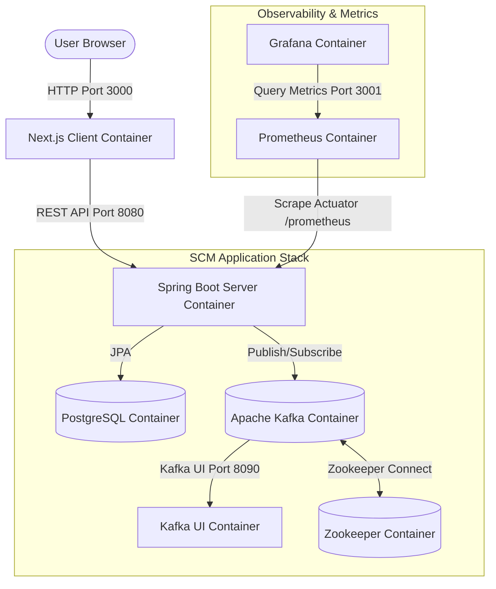

# 📦 SCM — Supply Chain Management System

A full-stack, production-ready Supply Chain Management platform built with **Next.js**, **Spring Boot**, **PostgreSQL**, **Apache Kafka**, and deployed on **AWS EKS** via **Docker** and **Kubernetes**.

---

## 🏗️ Architecture Overview



## 🧱 Tech Stack

| Layer | Technology |
|---|---|
| **Frontend** | Next.js 15, TypeScript, Zustand |
| **Backend** | Spring Boot 3.2, Java 17 |
| **Auth** | Spring Security, JWT (RS256), RBAC |
| **Database** | PostgreSQL 15 (RDS) |
| **Messaging** | Apache Kafka (event-driven order updates) |
| **Observability** | Prometheus + Grafana (JVM + business metrics) |
| **Containerization** | Docker, Docker Compose |
| **Orchestration** | Kubernetes (EKS), Kustomize, HPA, PDB |
| **IaC** | Terraform (VPC, EKS, RDS, ECR) |
| **CI/CD** | GitHub Actions (OIDC, no stored AWS keys) |

---

## 🚀 Quick Start (Local Development)

> **Prerequisites:** Docker Desktop, Node.js 20+, Java 17+, Maven

```bash
# 1. Clone and set up environment
git clone https://github.com/your-org/scm.git
cd scm
cp .env.example .env
# Edit .env with your local values

# 2. Start all services (Postgres, Kafka, Prometheus, Grafana, Backend, Frontend)
docker-compose up --build

# 3. Access the app
open http://localhost:3000          # Frontend
open http://localhost:8080/swagger-ui.html  # API Docs
open http://localhost:3001          # Grafana (admin/admin)
open http://localhost:8090          # Kafka UI
```

---

## 📁 Project Structure

```
scm/
├── scm-client/              # Next.js frontend
│   ├── src/app/             # App Router pages
│   ├── src/components/      # Reusable UI components
│   ├── src/lib/api.ts       # Typed API client
│   └── Dockerfile
│
├── scm-server/              # Spring Boot backend
│   ├── src/main/java/com/scm/server/
│   │   ├── config/          # Security, Kafka, JWT config
│   │   ├── controller/      # REST endpoints
│   │   ├── service/         # Business logic + Kafka producers/consumers
│   │   ├── model/           # JPA entities
│   │   ├── repository/      # Spring Data JPA repos
│   │   ├── event/           # Kafka event POJOs
│   │   └── dto/             # Request/Response DTOs
│   └── Dockerfile
│
├── k8s/                     # Kubernetes manifests
│   ├── base/                # Shared base (Kustomize)
│   ├── overlays/
│   │   ├── dev/             # Dev overrides (1 replica, DEBUG logs)
│   │   └── production/      # Prod overrides (image tags via CI/CD)
│   ├── scm-server/          # Deployment, Service, HPA
│   ├── scm-client/          # Deployment, Service
│   ├── ingress.yaml         # AWS ALB Ingress
│   ├── pdb.yaml             # PodDisruptionBudgets
│   └── network-policy.yaml  # Zero-trust NetworkPolicies
│
├── terraform/               # AWS infrastructure as code
│   ├── main.tf              # Provider + S3 backend
│   ├── variables.tf         # Input variables
│   ├── resources.tf         # VPC, ECR, EKS, RDS
│   └── outputs.tf           # ECR URLs, EKS endpoint, RDS endpoint
│
├── monitoring/
│   ├── prometheus/          # Prometheus scrape config
│   └── grafana/             # Grafana datasource + dashboard provisioning
│
├── .github/workflows/
│   └── deploy.yml           # CI/CD: Test → Build → Push → Deploy
│
├── docker-compose.yml       # Full local stack
└── .env.example             # Environment variable template
```

---

## 🔐 Environment Variables

Copy `.env.example` to `.env` and fill in the values:

```bash
cp .env.example .env
```

Key variables:

| Variable | Description |
|---|---|
| `SPRING_DATASOURCE_URL` | PostgreSQL JDBC URL |
| `SPRING_DATASOURCE_USERNAME` | DB username |
| `SPRING_DATASOURCE_PASSWORD` | DB password |
| `JWT_SECRET` | 256-bit hex secret for JWT signing |
| `CORS_ALLOWED_ORIGINS` | Comma-separated allowed origins |
| `NEXT_PUBLIC_API_URL` | Backend API URL for the frontend |

> ⚠️ **Never commit `.env` files.** Use AWS Secrets Manager in production.

---

## ☁️ AWS EC2 Free Tier Deployment (Docker Compose)

For a cost-optimized, single-instance deployment ideal for demonstration and resume building, see our complete step-by-step [AWS EC2 Free Tier Deployment Guide](file:///c:/Projects/SCM/deploy_ec2.md).

This deployment runs the full dockerized stack on a single `t2.micro` or `t3.micro` EC2 instance, keeping hosting costs entirely within the AWS Free Tier.

```mermaid
graph TD
    User([User Browser]) -->|HTTP:3000| Client[Next.js Container]
    User -->|HTTP:8080| API[Spring Boot Container]
    User -->|HTTP:8090| KUI[Kafka UI Container]

    subgraph AWS EC2 Instance (Amazon Linux 2023)
        direction TB
        Client -->|Fetch Data| API
        API -->|JPA| Postgres[(PostgreSQL Container)]
        API -->|Pub/Sub| Kafka[(Kafka Broker)]
        KUI -->|Monitor| Kafka
    end
```

---

## ☁️ AWS EKS Cluster Production Deployment (Enterprise)

### 1. Provision Infrastructure (Terraform)

```bash
cd terraform
terraform init
terraform plan -var="db_password=your-secure-password"
terraform apply -var="db_password=your-secure-password"

# Get outputs needed for next steps:
terraform output ecr_server_url
terraform output rds_endpoint
terraform output kubeconfig_command
```

### 2. Configure kubectl

```bash
# Output from terraform above:
aws eks update-kubeconfig --region us-east-1 --name scm-cluster
```

### 3. Apply Kubernetes Manifests

```bash
# Apply all base resources
kubectl apply -k k8s/overlays/production

# Apply security + HA policies
kubectl apply -f k8s/pdb.yaml
kubectl apply -f k8s/network-policy.yaml

# Check deployment status
kubectl get pods -n scm
```

### 4. Configure GitHub Secrets

In your GitHub repository → Settings → Secrets → Actions:

| Secret | Value |
|---|---|
| `AWS_ACCOUNT_ID` | Your 12-digit AWS account ID |

The CI/CD pipeline uses **GitHub OIDC** — no long-lived access keys are stored.

---

## 🧪 Testing

### Unit Tests
```bash
cd scm-server
mvn test
```

### Integration Tests (requires Docker)
```bash
cd scm-server
mvn verify
# Testcontainers will pull postgres:15-alpine and cp-kafka:7.6.0 on first run
```

### Frontend Type Check + Lint
```bash
cd scm-client
npm ci
npx tsc --noEmit
npm run lint
```

---

## 📊 Monitoring

After starting the local stack (`docker-compose up`):

1. Open **Grafana** at `http://localhost:3001` (admin / admin)
2. Import these dashboards from Grafana.com:
   - **JVM Micrometer**: ID `4701`
   - **Spring Boot 3.x**: ID `19004`
3. Open **Prometheus** at `http://localhost:9090` to run raw PromQL queries

---

## 🔄 CI/CD Pipeline

Every push to `main` triggers:

1. **Backend tests** — `mvn clean verify` with Testcontainers
2. **Frontend checks** — TypeScript + ESLint
3. **Docker build + ECR push** — Tagged with Git SHA (immutable) + `latest`
4. **EKS deploy** — `kustomize edit set image` + `kubectl apply -k` + rollout wait

PRs only run steps 1–2. Deployment requires the `production` environment approval gate.

---

## 📝 API Documentation

The Swagger UI is available at:
- **Local:** `http://localhost:8080/swagger-ui.html`
- **Production:** `https://api.scm.yourdomain.com/swagger-ui.html`


