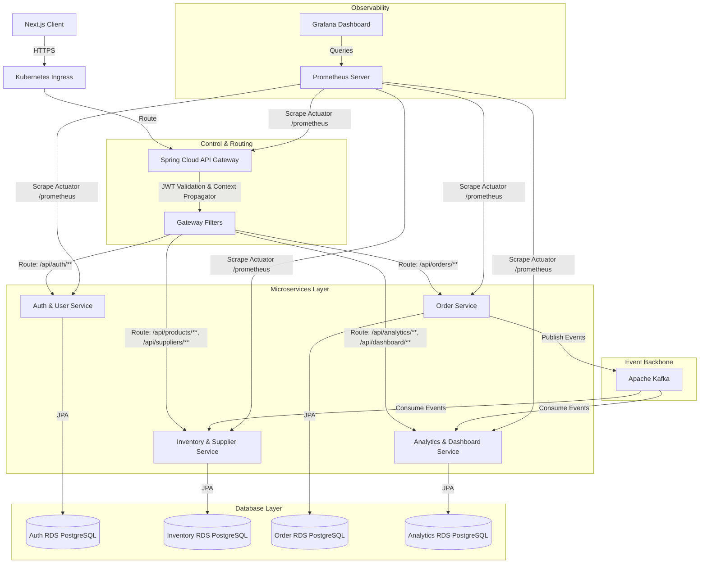

# Supply Chain Management (SCM) Architectural Transition Plan

This document outlines the step-by-step roadmap and technical architecture for transitioning the existing single-server Supply Chain Management (SCM) system into a highly scalable, distributed microservices-based architecture deployed on AWS (EKS) and monitored via Prometheus and Grafana.

---

## Architecture Blueprint



---

## ⚠️ Critical Architecture Advisory & Trade-Offs

Before executing this plan, it is critical to evaluate if a microservices pattern is suitable. For a medium-scale or early-stage SCM system, microservices can be a "double-edged sword."

### When to Avoid / Downsides
*   **Operational Overhead**: Managing one service is easy. Managing 5+ microservices, a Kafka cluster, API Gateway, Kubernetes control planes, Prometheus, and Grafana requires dedicated DevOps engineering.
*   **Distributed Transactions**: You can no longer use a simple database `@Transactional` block across domains. If stock updates fail after an order is placed, you must manage reconciliation manually or via rollback events.
*   **Network Latency**: Inter-service communication via REST or message queues adds network latency compared to memory-based calls.
*   **Local Dev Friction**: Running Kafka, Postgres, and 5 Java applications locally requires substantial CPU and RAM (minimum 16GB).

### Recommended Alternative: The "Modular Monolith"
If you want to keep deployments simple while keeping code clean:
1.  Organize the Spring Boot application into separate Java packages by domain (`com.scm.server.auth`, `com.scm.server.inventory`, `com.scm.server.order`, `com.scm.server.analytics`).
2.  Enforce strict boundary rules (e.g., classes in `order` package can only reference services in `inventory` through a well-defined public interface).
3.  Deploy a single Spring Boot container to AWS App Runner or ECS, using a single RDS database instance.
4.  *This achieves 90% of the code cleanliness with 10% of the operational complexity.*

> [!IMPORTANT]
> **Decision Point**: If this project is for resume building, learning distributed system concepts, or handles high throughput under separate team owners, proceed with the microservices plan below.

---

## 1. Microservices Decomposition Plan

We will split the current `scm-server` into 5 distinct services, each with its own repository/directory and database.

### A. Auth & User Service
*   **Responsibilities**: Registration, login, password hashing (BCrypt), JWT token generation, role-based database mapping.
*   **Entities**: `User`, `Role`
*   **Database**: `scm_auth_db`

### B. Inventory & Supplier Service
*   **Responsibilities**: Supplier registry management, product inventory catalog, stock count updates, safety stock notifications.
*   **Entities**: `Product`, `Supplier`
*   **Database**: `scm_inventory_db`
*   **Kafka Integration**: Listens to `order-events` topic to adjust product stock counts upon order completion.

### C. Order Service
*   **Responsibilities**: Purchase order creation, order state machine (`PENDING` -> `COMPLETED`/`CANCELLED`), order line-items calculations.
*   **Entities**: `Order`, `OrderItem` (references `productId` instead of JPA `Product` entity relationship).
*   **Database**: `scm_order_db`
*   **Kafka Integration**: Publishes `OrderStateChangedEvent` to `order-events` topic.

### D. Analytics & Dashboard Service
*   **Responsibilities**: System-wide audit log collection, analytics reports calculations (COGS, Margins), dashboard stats caching.
*   **Entities**: `AuditLog`
*   **Database**: `scm_analytics_db`
*   **Kafka Integration**: Consumes all event topics to assemble real-time financial dashboards and write persistent audit logs.

### E. API Gateway (Spring Cloud Gateway)
*   **Responsibilities**: Single entry-point, JWT authentication filter, header propagation, rate-limiting (via Redis RateLimiter).
*   **Security Configuration**: Performs token verification using the Shared JWT Secret. Extracts user claims and appends them to request headers:
    ```
    X-User-Id: [User UUID]
    X-User-Roles: [ROLE_ADMIN, ROLE_MANAGER]
    ```
*   Downstream microservices bypass standard JWT decoding and read the `X-User-Id` / `X-User-Roles` headers directly to establish security contexts, saving CPU cycles.

---

## 2. Distributed Transactions & Eventual Consistency (Kafka)

In a microservices architecture, the [OrderService](file:///c:/Projects/SCM/scm-server/src/main/java/com/scm/server/service/OrderService.java) cannot lock and update the `Product` table directly because they belong to different databases. We use **Apache Kafka** to establish eventual consistency.

### Workflow: Order Completion
1.  **User action**: Manager clicks "Complete Order" on Next.js frontend.
2.  **Order Service**:
    *   Begins a local database transaction.
    *   Updates the Order status to `COMPLETED` in `scm_order_db`.
    *   Saves an outbound event payload in an `outbox` table (Transactional Outbox Pattern) to prevent data loss if Kafka is down.
    *   Commits the local transaction.
    *   Publishes `OrderCompletedEvent` to `order-events` topic:
        ```json
        {
          "eventId": "a9d74b9e-...",
          "orderId": "e305e940-...",
          "status": "COMPLETED",
          "items": [
            { "productId": "c33a9212-...", "quantity": 150 },
            { "productId": "b22c8101-...", "quantity": 50 }
          ]
        }
        ```
3.  **Inventory Service**:
    *   Consumes the `OrderCompletedEvent` from `order-events` topic.
    *   Processes the event idempotently by checking if `eventId` has been processed before (saving processed event IDs in an `idempotency_keys` table).
    *   Executes a local database transaction to increase/decrease the stock counts for the listed `productId`s in `scm_inventory_db`.
    *   Commits the transaction.
4.  **Analytics Service**:
    *   Consumes the same event, recalculates financial metrics, and writes an entry to the `AuditLog` table.

> [!TIP]
> **Error Handling**: Implement a **Dead Letter Queue (DLQ)** topic `order-events-dlq`. If the Inventory Service fails to parse or process an event after 3 retries, route the message to the DLQ and fire a PagerDuty/Slack alert for manual intervention.

---

## 3. DevOps & Containerization (Docker & Kubernetes)

### Local Dev Setup: Docker Compose
We will create a root [docker-compose.yml](file:///c:/Projects/SCM/docker-compose.yml) to spin up the infrastructure and services locally:

```yaml
version: '3.8'

services:
  # Databases
  postgres:
    image: postgres:15-alpine
    environment:
      POSTGRES_MULTIPLE_DATABASES: scm_auth,scm_inventory,scm_order,scm_analytics
      POSTGRES_USER: scm_admin
      POSTGRES_PASSWORD: scm_password
    ports:
      - "5432:5432"
    volumes:
      - pgdata:/var/lib/postgresql/data
      - ./db-init:/docker-entrypoint-initdb.d

  # Messaging
  zookeeper:
    image: confluentinc/cp-zookeeper:7.3.0
    environment:
      ZOOKEEPER_CLIENT_PORT: 2181

  kafka:
    image: confluentinc/cp-kafka:7.3.0
    depends_on:
      - zookeeper
    ports:
      - "9092:9092"
    environment:
      KAFKA_BROKER_ID: 1
      KAFKA_ZOOKEEPER_CONNECT: zookeeper:2181
      KAFKA_ADVERTISED_LISTENERS: PLAINTEXT://kafka:29092,PLAINTEXT_HOST://localhost:9092
      KAFKA_LISTENER_SECURITY_PROTOCOL_MAP: PLAINTEXT:PLAINTEXT,PLAINTEXT_HOST:PLAINTEXT
      KAFKA_INTER_BROKER_LISTENER_NAME: PLAINTEXT
      KAFKA_OFFSETS_TOPIC_REPLICATION_FACTOR: 1

  # Microservices
  api-gateway:
    build: ./api-gateway
    ports:
      - "8080:8080"
    environment:
      - SPRING_PROFILES_ACTIVE=dev
      - AUTH_SERVICE_URL=http://auth-service:8081
      - INVENTORY_SERVICE_URL=http://inventory-service:8082
      - ORDER_SERVICE_URL=http://order-service:8083
      - ANALYTICS_SERVICE_URL=http://analytics-service:8084
      - JWT_SECRET=3c9909d3ee9e557161b947c92b23a78f3048598...

  auth-service:
    build: ./auth-service
    ports:
      - "8081:8081"
    environment:
      - SPRING_DATASOURCE_URL=jdbc:postgresql://postgres:5432/scm_auth
      - JWT_SECRET=3c9909d3ee9e557161b947c92b23a78f3048598...

  # (Repeat for inventory-service, order-service, analytics-service)

volumes:
  pgdata:
```

### Production: Kubernetes (EKS Manifests)
For production, we will structure manifests under a `/k8s` folder:
*   `ingress.yaml`: Configures ALB (Application Load Balancer) Ingress Controller on AWS to route public traffic to the API Gateway.
*   `gateway-deployment.yaml` & `gateway-service.yaml`: Gateway service mapping.
*   `configmap.yaml` & `secrets.yaml`: Shared configurations and DB passwords.
*   `services/`: Subdirectories for each microservice containing `deployment.yaml`, `service.yaml`, and `hpa.yaml` (Horizontal Pod Autoscaler).

Example deployment manifest snippet (`inventory-service`):
```yaml
apiVersion: apps/v1
kind: Deployment
metadata:
  name: inventory-service
  namespace: scm
spec:
  replicas: 2
  selector:
    matchLabels:
      app: inventory-service
  template:
    metadata:
      labels:
        app: inventory-service
    spec:
      containers:
      - name: inventory-service
        image: <aws_account_id>.dkr.ecr.us-east-1.amazonaws.com/scm-inventory-service:latest
        ports:
        - containerPort: 8082
        env:
        - name: SPRING_DATASOURCE_URL
          value: "jdbc:postgresql://scm-rds.cluster-xyz.us-east-1.rds.amazonaws.com:5432/scm_inventory"
        - name: SPRING_DATASOURCE_PASSWORD
          valueFrom:
            secretKeyRef:
              name: scm-db-secrets
              key: database-password
        resources:
          limits:
            cpu: "1"
            memory: 1Gi
          requests:
            cpu: 250m
            memory: 512Mi
        readinessProbe:
          httpGet:
            path: /actuator/health/readiness
            port: 8082
          initialDelaySeconds: 20
          periodSeconds: 10
```

---

## 4. AWS Cloud Setup & Infrastructure

### A. Managed K8s (EKS)
*   **Provisioning**: Use AWS CDK or Terraform to build a VPC with 2 public subnets and 2 private subnets.
*   **Control Plane**: EKS Cluster in the private subnets.
*   **Data Plane**: Managed Node Groups (using `t3.medium` instances) or AWS Fargate for serverless scaling.
*   **Security Integration (IRSA)**: Enable IAM Roles for Service Accounts. This maps K8s Service Accounts directly to AWS IAM roles. Instead of hardcoding credentials, pods assume AWS IAM roles automatically (e.g., to fetch keys from Secrets Manager or send emails via SES).

### B. Databases (RDS PostgreSQL)
*   **Engine**: Amazon Aurora Serverless v2 PostgreSQL (reduces cost during idle hours and scales up to 128 ACUs under load).
*   **Architecture**: Multi-AZ deployment for high availability with auto-failover.
*   **Schemas**: Instead of running 4 separate physical DB instances (which is expensive), deploy a single Aurora PostgreSQL Cluster and create 4 distinct logical databases: `scm_auth`, `scm_inventory`, `scm_order`, `scm_analytics`. Access to these databases is segregated using different database users (`auth_user`, `inventory_user`, etc.).

### C. Container Registry (ECR)
*   Create 5 separate ECR repositories:
    1. `scm-api-gateway`
    2. `scm-auth-service`
    3. `scm-inventory-service`
    4. `scm-order-service`
    5. `scm-analytics-service`
    6. `scm-client`

### D. AWS Secrets Manager Integration
*   Store all sensitive configs (JWT keys, DB root credentials, API tokens) in AWS Secrets Manager.
*   Use the **AWS Secrets Store CSI Driver** to mount secrets directly into pod container filesystems as files, or fetch them dynamically using the `spring-cloud-starter-aws-secrets-manager-config` dependency.

---

## 5. CI/CD Pipeline (GitHub Actions)

We will configure GitHub Actions workflows inside `.github/workflows/deploy.yml`.

### Workflow Steps
1.  **Trigger**: Code pushed to `main` branch or a Pull Request merged.
2.  **Lint & Test**:
    *   Java services: Run checkstyle, unit tests, and integration tests (`mvn clean test`).
    *   Next.js client: Run ESLint and TypeScript compilation check (`npm run lint && npm run build`).
3.  **Docker Build & Multi-Arch Tagging**:
    *   Build Docker images using multi-stage builds.
    *   Inject git-sha as the image tag (`scm-auth-service:sha-${{ github.sha }}`) along with `latest`.
4.  **AWS Authentication**:
    *   Authenticate securely using OpenID Connect (OIDC) via `aws-actions/configure-aws-credentials`. (No long-lived AWS IAM access keys stored in GitHub).
5.  **ECR Push**:
    *   Log in to AWS ECR and push the generated images.
6.  **K8s Deployment**:
    *   Update image tags in the K8s deployment manifests using `kustomize` or `sed`.
    *   Apply manifests using `kubectl apply -f k8s/` or upgrade via Helm.

---

## 6. Monitoring & Observability (Prometheus + Grafana)

### A. Metrics Collection (Prometheus)
1.  Add Prometheus and Actuator dependencies to every microservice `pom.xml`:
    ```xml
    <dependency>
        <groupId>org.springframework.boot</groupId>
        <artifactId>spring-boot-starter-actuator</artifactId>
    </dependency>
    <dependency>
        <groupId>io.micrometer</groupId>
        <artifactId>micrometer-registry-prometheus</artifactId>
    </dependency>
    ```
2.  Configure `application.yml` to expose Prometheus metrics endpoint:
    ```yaml
    management:
      endpoints:
        web:
          exposure:
            include: health, info, prometheus
      endpoint:
        health:
          show-details: always
    ```
3.  Deploy Prometheus Operator inside the EKS cluster.
4.  Define a `ServiceMonitor` resource in K8s to automatically discover and scrape the `/actuator/prometheus` endpoint on port `8080`/`8081`/etc.

### B. Dashboard Visualization (Grafana)
*   Import official dashboards (e.g., JVM Dashboard - ID `4701`, Spring Boot Dashboard - ID `11378`).
*   Configure custom alert channels (Slack/Email) to trigger when:
    *   Container CPU usage > 85% for 5 minutes.
    *   API response rate (HTTP 5xx error rate) > 2% of total traffic.
    *   Kafka consumer lag is growing (indicates Inventory/Analytics service cannot keep up with orders).

### C. Distributed Tracing (OpenTelemetry)
*   Add the **OpenTelemetry Java Agent** to the docker container startups.
*   The agent injects `traceId` and `spanId` into all headers and logs.
*   When a request flows from Next.js -> API Gateway -> Order Service -> Kafka -> Inventory Service, the `traceId` remains identical.
*   Query trace paths using **Zipkin** or **Jaeger** to identify network bottlenecks immediately.

---

## 7. Fetching External APIs & Cloud Resources

### How to Fetch/Integrate External APIs
For operations like fetching shipping quotes from DHL/FedEx or integrating external supplier inventories:
1.  **Resilient HTTP Client**: Use **WebClient** (Spring WebFlux) instead of the blocking `RestTemplate`.
2.  **Circuit Breaker (Resilience4j)**: Wrap external API calls with a Circuit Breaker to prevent cascading failures if the external provider is down:
    ```java
    @CircuitBreaker(name = "supplierApi", fallbackMethod = "getSupplierCatalogFallback")
    public SupplierCatalog getSupplierCatalog(String supplierId) {
        return webClient.get()
                .uri("/suppliers/{id}/catalog", supplierId)
                .retrieve()
                .bodyToMono(SupplierCatalog.class)
                .block(Duration.ofSeconds(3)); // Timeout
    }
    ```
3.  **Secure Credentials**: Never store external API keys in code or properties. Use AWS Secrets Manager and map them to environment variables.

---

## Verification & Testing Plan

### Automated Verification
*   **Component Unit Tests**: Write tests using Mockito and JUnit 5 for separate services.
*   **Contract Testing (Spring Cloud Contract / Pact)**: Ensure that API changes in the Auth/Inventory/Order services do not break contracts expected by the API Gateway or Next.js Client.
*   **Integration Tests**: Run test suites using **Testcontainers** to spin up actual PostgreSQL and Kafka instances in Docker dynamically during the build stage.

### Manual Verification
1.  Verify the local container setup using `docker-compose up --build`.
2.  Run Postman or Curl requests to the Gateway (`http://localhost:8080/api/auth/login`) to retrieve JWT.
3.  Use the JWT to call the protected routing endpoints (`/api/products`, `/api/orders`) and verify downstream header routing.
4.  Kill the Inventory Service, create an order, verify the message resides in Kafka, restart the Inventory Service, and verify the message is processed and stock is updated (Eventual Consistency test).
